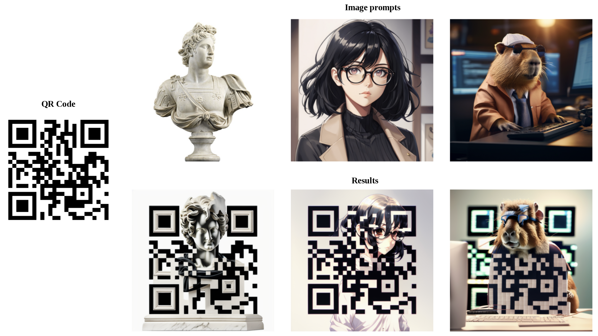

# QRCodeControlnetIPAdapter
Example of QR-Code generation using Controlnet + IP Adapter.

## Acknowledgements
[stable-diffusion-qrcode](https://github.com/latentminds/stable-diffusion-qrcode) is used as base.

## Contacts

Issues should be raised directly in the repository. For professional support and recommendations please <a>welcomedenk@gmail.com</a>.
